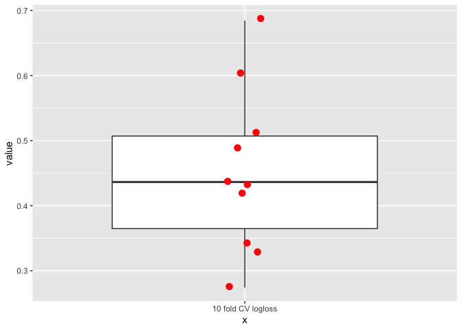

### Model: CD\_vs\_UC-species-XGBoost-k=10-p=0.8

    list_object <- fit_and_evaluate(
        "IBD_vs_nonIBD",
        "species",
        "XGBoost",
        k = 10,
        p = 0.8,
        seed = 4)

### Logloss

    kable(list_object$logloss)

<table>
<thead>
<tr class="header">
<th style="text-align: right;">mean</th>
<th style="text-align: right;">sd</th>
</tr>
</thead>
<tbody>
<tr class="odd">
<td style="text-align: right;">0.4536522</td>
<td style="text-align: right;">0.1253982</td>
</tr>
</tbody>
</table>

    list_object$logloss_plot

### Confusion matrices per k-fold

    map(list_object$confusion_matrix, ~kable(.x))

    ## $Resample01
    ## 
    ## 
    ## Prediction   Reference    Freq
    ## -----------  ----------  -----
    ## 0            0               8
    ## 1            0               5
    ## 0            1               1
    ## 1            1              19
    ## 
    ## $Resample02
    ## 
    ## 
    ## Prediction   Reference    Freq
    ## -----------  ----------  -----
    ## 0            0              10
    ## 1            0               3
    ## 0            1               2
    ## 1            1              18
    ## 
    ## $Resample03
    ## 
    ## 
    ## Prediction   Reference    Freq
    ## -----------  ----------  -----
    ## 0            0               8
    ## 1            0               5
    ## 0            1               4
    ## 1            1              16
    ## 
    ## $Resample04
    ## 
    ## 
    ## Prediction   Reference    Freq
    ## -----------  ----------  -----
    ## 0            0              12
    ## 1            0               1
    ## 0            1               1
    ## 1            1              19
    ## 
    ## $Resample05
    ## 
    ## 
    ## Prediction   Reference    Freq
    ## -----------  ----------  -----
    ## 0            0               8
    ## 1            0               5
    ## 0            1               1
    ## 1            1              19
    ## 
    ## $Resample06
    ## 
    ## 
    ## Prediction   Reference    Freq
    ## -----------  ----------  -----
    ## 0            0               6
    ## 1            0               7
    ## 0            1               6
    ## 1            1              14
    ## 
    ## $Resample07
    ## 
    ## 
    ## Prediction   Reference    Freq
    ## -----------  ----------  -----
    ## 0            0              10
    ## 1            0               3
    ## 0            1               1
    ## 1            1              19
    ## 
    ## $Resample08
    ## 
    ## 
    ## Prediction   Reference    Freq
    ## -----------  ----------  -----
    ## 0            0               9
    ## 1            0               4
    ## 0            1               5
    ## 1            1              15
    ## 
    ## $Resample09
    ## 
    ## 
    ## Prediction   Reference    Freq
    ## -----------  ----------  -----
    ## 0            0               8
    ## 1            0               5
    ## 0            1               3
    ## 1            1              17
    ## 
    ## $Resample10
    ## 
    ## 
    ## Prediction   Reference    Freq
    ## -----------  ----------  -----
    ## 0            0              10
    ## 1            0               3
    ## 0            1               3
    ## 1            1              17
