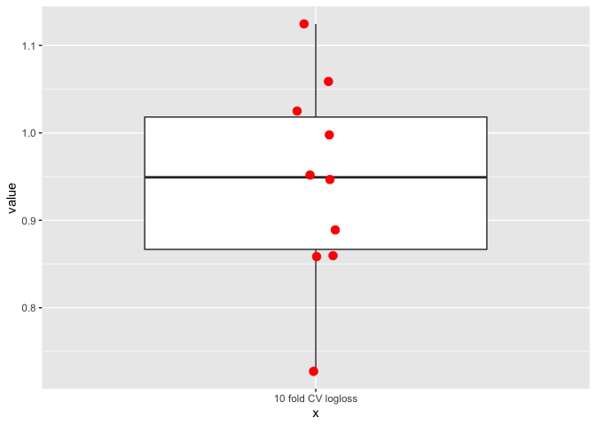

### Model: UC\_vs\_CD-pathway-randomForest-k=10-p=0.8

    ## Warning in confusionMatrix.default(pred, as.factor(test$group), positive = "1"):
    ## Levels are not in the same order for reference and data. Refactoring data to
    ## match.

### Logloss

<table>
<thead>
<tr class="header">
<th style="text-align: right;">mean</th>
<th style="text-align: right;">sd</th>
</tr>
</thead>
<tbody>
<tr class="odd">
<td style="text-align: right;">0.2720206</td>
<td style="text-align: right;">0.0264544</td>
</tr>
</tbody>
</table>

### Confusion matrices per k-fold

    ## Warning in kable_markdown(x, padding = padding, ...): The table should have a
    ## header (column names)

    ## Warning in kable_markdown(x, padding = padding, ...): The table should have a
    ## header (column names)

    ## Warning in kable_markdown(x, padding = padding, ...): The table should have a
    ## header (column names)

    ## Warning in kable_markdown(x, padding = padding, ...): The table should have a
    ## header (column names)

    ## Warning in kable_markdown(x, padding = padding, ...): The table should have a
    ## header (column names)

    ## Warning in kable_markdown(x, padding = padding, ...): The table should have a
    ## header (column names)

    ## Warning in kable_markdown(x, padding = padding, ...): The table should have a
    ## header (column names)

    ## Warning in kable_markdown(x, padding = padding, ...): The table should have a
    ## header (column names)

    ## Warning in kable_markdown(x, padding = padding, ...): The table should have a
    ## header (column names)

    ## Warning in kable_markdown(x, padding = padding, ...): The table should have a
    ## header (column names)

$Resample01

|| || || ||

$Resample02

|| || || ||

$Resample03

|| || || ||

$Resample04

|| || || ||

$Resample05

|| || || ||

$Resample06

|| || || ||

$Resample07

|| || || ||

$Resample08

|| || || ||

$Resample09

|| || || ||

$Resample10

|| || || ||
