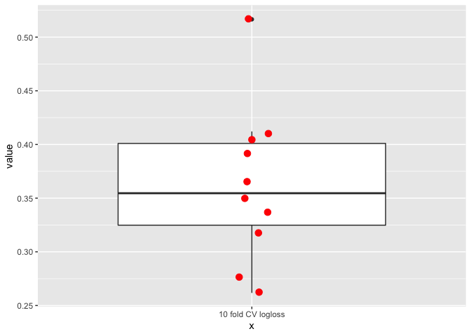

### Model: UC\_vs\_nonIBD-species-randomForest-k=10-p=0.8

    ## Warning in confusionMatrix.default(pred, as.factor(test$group), positive = "1"):
    ## Levels are not in the same order for reference and data. Refactoring data to
    ## match.

### Logloss

<table>
<thead>
<tr class="header">
<th style="text-align: right;">mean</th>
<th style="text-align: right;">sd</th>
</tr>
</thead>
<tbody>
<tr class="odd">
<td style="text-align: right;">0.3631689</td>
<td style="text-align: right;">0.0734797</td>
</tr>
</tbody>
</table>

### Confusion matrices per k-fold

$Resample01

<table>
<thead>
<tr class="header">
<th style="text-align: left;">Prediction</th>
<th style="text-align: left;">Reference</th>
<th style="text-align: right;">Freq</th>
</tr>
</thead>
<tbody>
<tr class="odd">
<td style="text-align: left;">nonIBD</td>
<td style="text-align: left;">nonIBD</td>
<td style="text-align: right;">13</td>
</tr>
<tr class="even">
<td style="text-align: left;">UC</td>
<td style="text-align: left;">nonIBD</td>
<td style="text-align: right;">0</td>
</tr>
<tr class="odd">
<td style="text-align: left;">nonIBD</td>
<td style="text-align: left;">UC</td>
<td style="text-align: right;">2</td>
</tr>
<tr class="even">
<td style="text-align: left;">UC</td>
<td style="text-align: left;">UC</td>
<td style="text-align: right;">1</td>
</tr>
</tbody>
</table>

$Resample02

<table>
<thead>
<tr class="header">
<th style="text-align: left;">Prediction</th>
<th style="text-align: left;">Reference</th>
<th style="text-align: right;">Freq</th>
</tr>
</thead>
<tbody>
<tr class="odd">
<td style="text-align: left;">nonIBD</td>
<td style="text-align: left;">nonIBD</td>
<td style="text-align: right;">8</td>
</tr>
<tr class="even">
<td style="text-align: left;">UC</td>
<td style="text-align: left;">nonIBD</td>
<td style="text-align: right;">5</td>
</tr>
<tr class="odd">
<td style="text-align: left;">nonIBD</td>
<td style="text-align: left;">UC</td>
<td style="text-align: right;">1</td>
</tr>
<tr class="even">
<td style="text-align: left;">UC</td>
<td style="text-align: left;">UC</td>
<td style="text-align: right;">2</td>
</tr>
</tbody>
</table>

$Resample03

<table>
<thead>
<tr class="header">
<th style="text-align: left;">Prediction</th>
<th style="text-align: left;">Reference</th>
<th style="text-align: right;">Freq</th>
</tr>
</thead>
<tbody>
<tr class="odd">
<td style="text-align: left;">nonIBD</td>
<td style="text-align: left;">nonIBD</td>
<td style="text-align: right;">13</td>
</tr>
<tr class="even">
<td style="text-align: left;">UC</td>
<td style="text-align: left;">nonIBD</td>
<td style="text-align: right;">0</td>
</tr>
<tr class="odd">
<td style="text-align: left;">nonIBD</td>
<td style="text-align: left;">UC</td>
<td style="text-align: right;">2</td>
</tr>
<tr class="even">
<td style="text-align: left;">UC</td>
<td style="text-align: left;">UC</td>
<td style="text-align: right;">1</td>
</tr>
</tbody>
</table>

$Resample04

<table>
<thead>
<tr class="header">
<th style="text-align: left;">Prediction</th>
<th style="text-align: left;">Reference</th>
<th style="text-align: right;">Freq</th>
</tr>
</thead>
<tbody>
<tr class="odd">
<td style="text-align: left;">nonIBD</td>
<td style="text-align: left;">nonIBD</td>
<td style="text-align: right;">11</td>
</tr>
<tr class="even">
<td style="text-align: left;">UC</td>
<td style="text-align: left;">nonIBD</td>
<td style="text-align: right;">2</td>
</tr>
<tr class="odd">
<td style="text-align: left;">nonIBD</td>
<td style="text-align: left;">UC</td>
<td style="text-align: right;">3</td>
</tr>
<tr class="even">
<td style="text-align: left;">UC</td>
<td style="text-align: left;">UC</td>
<td style="text-align: right;">0</td>
</tr>
</tbody>
</table>

$Resample05

<table>
<thead>
<tr class="header">
<th style="text-align: left;">Prediction</th>
<th style="text-align: left;">Reference</th>
<th style="text-align: right;">Freq</th>
</tr>
</thead>
<tbody>
<tr class="odd">
<td style="text-align: left;">nonIBD</td>
<td style="text-align: left;">nonIBD</td>
<td style="text-align: right;">13</td>
</tr>
<tr class="even">
<td style="text-align: left;">UC</td>
<td style="text-align: left;">nonIBD</td>
<td style="text-align: right;">0</td>
</tr>
<tr class="odd">
<td style="text-align: left;">nonIBD</td>
<td style="text-align: left;">UC</td>
<td style="text-align: right;">2</td>
</tr>
<tr class="even">
<td style="text-align: left;">UC</td>
<td style="text-align: left;">UC</td>
<td style="text-align: right;">1</td>
</tr>
</tbody>
</table>

$Resample06

<table>
<thead>
<tr class="header">
<th style="text-align: left;">Prediction</th>
<th style="text-align: left;">Reference</th>
<th style="text-align: right;">Freq</th>
</tr>
</thead>
<tbody>
<tr class="odd">
<td style="text-align: left;">nonIBD</td>
<td style="text-align: left;">nonIBD</td>
<td style="text-align: right;">12</td>
</tr>
<tr class="even">
<td style="text-align: left;">UC</td>
<td style="text-align: left;">nonIBD</td>
<td style="text-align: right;">1</td>
</tr>
<tr class="odd">
<td style="text-align: left;">nonIBD</td>
<td style="text-align: left;">UC</td>
<td style="text-align: right;">2</td>
</tr>
<tr class="even">
<td style="text-align: left;">UC</td>
<td style="text-align: left;">UC</td>
<td style="text-align: right;">1</td>
</tr>
</tbody>
</table>

$Resample07

<table>
<thead>
<tr class="header">
<th style="text-align: left;">Prediction</th>
<th style="text-align: left;">Reference</th>
<th style="text-align: right;">Freq</th>
</tr>
</thead>
<tbody>
<tr class="odd">
<td style="text-align: left;">nonIBD</td>
<td style="text-align: left;">nonIBD</td>
<td style="text-align: right;">13</td>
</tr>
<tr class="even">
<td style="text-align: left;">UC</td>
<td style="text-align: left;">nonIBD</td>
<td style="text-align: right;">0</td>
</tr>
<tr class="odd">
<td style="text-align: left;">nonIBD</td>
<td style="text-align: left;">UC</td>
<td style="text-align: right;">3</td>
</tr>
<tr class="even">
<td style="text-align: left;">UC</td>
<td style="text-align: left;">UC</td>
<td style="text-align: right;">0</td>
</tr>
</tbody>
</table>

$Resample08

<table>
<thead>
<tr class="header">
<th style="text-align: left;">Prediction</th>
<th style="text-align: left;">Reference</th>
<th style="text-align: right;">Freq</th>
</tr>
</thead>
<tbody>
<tr class="odd">
<td style="text-align: left;">nonIBD</td>
<td style="text-align: left;">nonIBD</td>
<td style="text-align: right;">10</td>
</tr>
<tr class="even">
<td style="text-align: left;">UC</td>
<td style="text-align: left;">nonIBD</td>
<td style="text-align: right;">3</td>
</tr>
<tr class="odd">
<td style="text-align: left;">nonIBD</td>
<td style="text-align: left;">UC</td>
<td style="text-align: right;">1</td>
</tr>
<tr class="even">
<td style="text-align: left;">UC</td>
<td style="text-align: left;">UC</td>
<td style="text-align: right;">2</td>
</tr>
</tbody>
</table>

$Resample09

<table>
<thead>
<tr class="header">
<th style="text-align: left;">Prediction</th>
<th style="text-align: left;">Reference</th>
<th style="text-align: right;">Freq</th>
</tr>
</thead>
<tbody>
<tr class="odd">
<td style="text-align: left;">nonIBD</td>
<td style="text-align: left;">nonIBD</td>
<td style="text-align: right;">12</td>
</tr>
<tr class="even">
<td style="text-align: left;">UC</td>
<td style="text-align: left;">nonIBD</td>
<td style="text-align: right;">1</td>
</tr>
<tr class="odd">
<td style="text-align: left;">nonIBD</td>
<td style="text-align: left;">UC</td>
<td style="text-align: right;">3</td>
</tr>
<tr class="even">
<td style="text-align: left;">UC</td>
<td style="text-align: left;">UC</td>
<td style="text-align: right;">0</td>
</tr>
</tbody>
</table>

$Resample10

<table>
<thead>
<tr class="header">
<th style="text-align: left;">Prediction</th>
<th style="text-align: left;">Reference</th>
<th style="text-align: right;">Freq</th>
</tr>
</thead>
<tbody>
<tr class="odd">
<td style="text-align: left;">nonIBD</td>
<td style="text-align: left;">nonIBD</td>
<td style="text-align: right;">11</td>
</tr>
<tr class="even">
<td style="text-align: left;">UC</td>
<td style="text-align: left;">nonIBD</td>
<td style="text-align: right;">2</td>
</tr>
<tr class="odd">
<td style="text-align: left;">nonIBD</td>
<td style="text-align: left;">UC</td>
<td style="text-align: right;">3</td>
</tr>
<tr class="even">
<td style="text-align: left;">UC</td>
<td style="text-align: left;">UC</td>
<td style="text-align: right;">0</td>
</tr>
</tbody>
</table>
